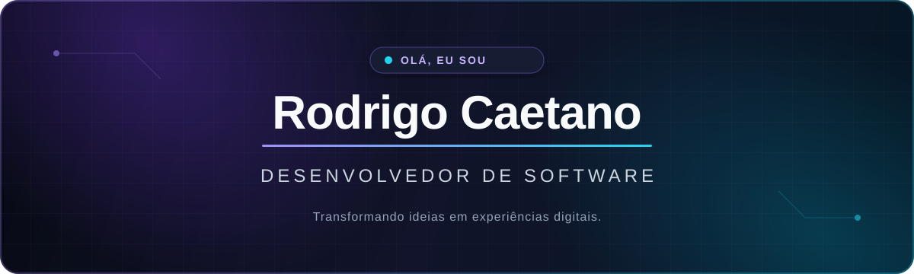

  

   

  
  

## Sobre mim

Sou **Rodrigo Caetano**, desenvolvedor de software interessado em transformar ideias em experiências digitais úteis, intuitivas e bem construídas.

- 💻 Construo aplicações para **web e mobile**;
- 🧩 Gosto de unir interfaces claras a back-ends eficientes;
- 🌱 Estou sempre aprimorando minhas habilidades e explorando novas tecnologias;
- 🤝 Aberto a colaborar em projetos e trocar conhecimento com a comunidade.

## Tecnologias e ferramentas

### Front-end & Mobile

### Back-end & Dados

### Fluxo de trabalho

## GitHub em números

  <picture>
    <source media="(prefers-color-scheme: dark)" srcset="https://github-readme-stats.vercel.app/api?username=RodrickCS&show_icons=true&hide_border=true&bg_color=00000000&title_color=a78bfa&icon_color=22d3ee&text_color=e5e7eb&locale=pt-br" />
    
  </picture>
  <picture>
    <source media="(prefers-color-scheme: dark)" srcset="https://github-readme-stats.vercel.app/api/top-langs/?username=RodrickCS&layout=compact&hide_border=true&bg_color=00000000&title_color=a78bfa&text_color=e5e7eb&locale=pt-br" />
    
  </picture>

## Vamos criar algo juntos?

Se você tem uma ideia, uma oportunidade ou simplesmente quer conversar sobre tecnologia, será um prazer falar com você.

  <a href="mailto:caetanorodrigo46@gmail.com"><strong>Enviar um e-mail</strong></a>
  &nbsp;•&nbsp;
  <a href="https://www.linkedin.com/in/rodrigo-caetano-391648239/"><strong>Visitar meu LinkedIn</strong></a>

 

  Desenvolvido com dedicação por Rodrigo Caetano.

